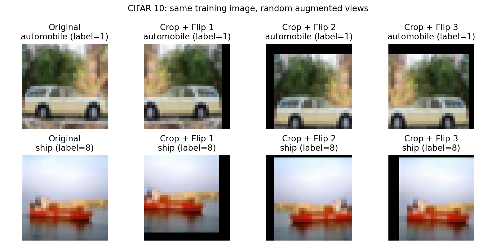
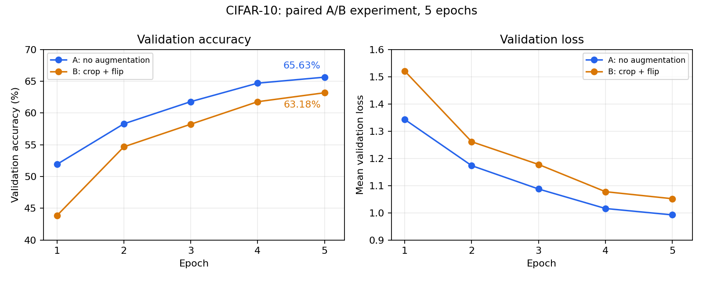
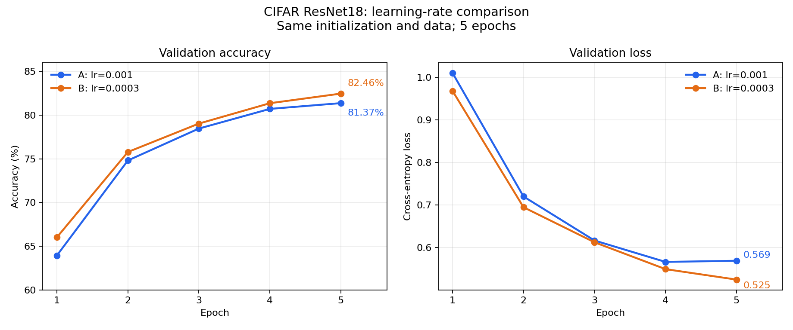
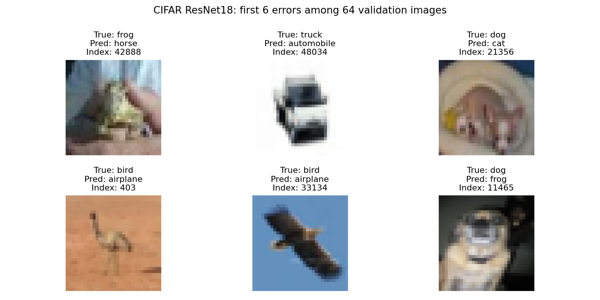
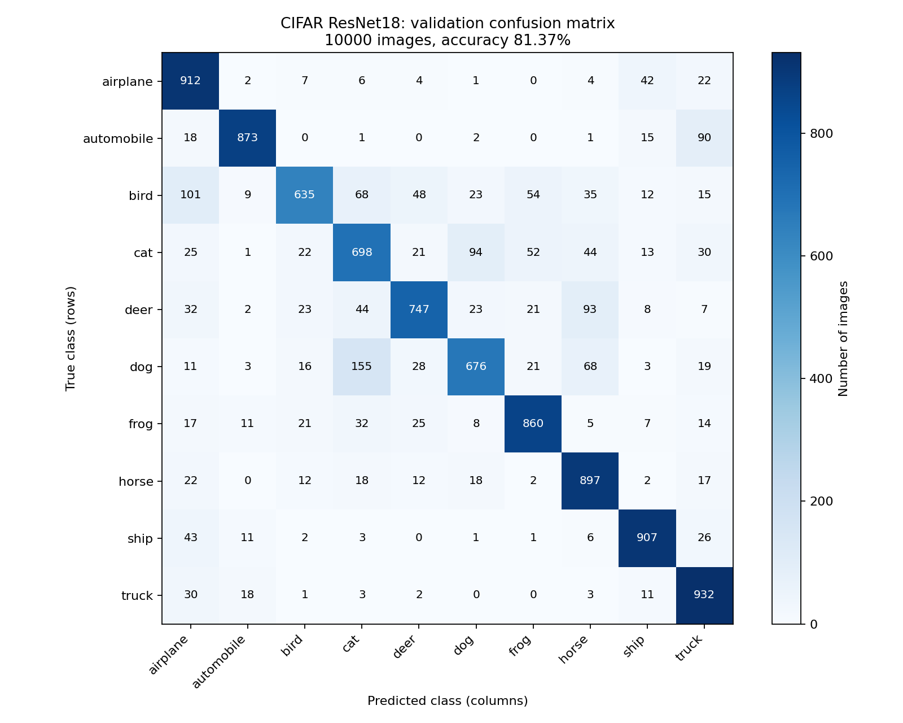

# CIFAR-10 图像分类与对照实验

一个使用 PyTorch、在 AI 辅助下逐步完成的图像分类学习项目。项目从 SimpleCNN 的数据读取、前向计算和训练开始，进一步开展数据增强、模型结构和学习率对照，并通过错误图片与混淆矩阵分析模型表现。

目标是理解如何修改代码、排查问题、设计对照和解释实验结果。当前已记录的最高验证准确率为 **82.46%**，来自适配 CIFAR-10 的 ResNet18、Adam 学习率 `0.0003`、训练5轮的实验；固定选取该组最佳权重后，2026-10-08完成官方测试集评估，测试准确率为 **81.48%**。

## 数据与预处理

CIFAR-10 图片为 `32×32` 的 RGB 图像，共10类：飞机、汽车、鸟、猫、鹿、狗、青蛙、马、船和卡车。代码中的类别编号依次为 `0～9`，英文名称为 `airplane` 至 `truck`。

| 数据用途 | 图片数量 | 来源与用途 |
| --- | ---: | --- |
| 对照实验训练集 | 40,000 | 从官方50,000张训练图片中划分，每类4,000张，用于更新模型参数 |
| 对照实验验证集 | 10,000 | 从同一官方训练集划分，每类1,000张，用于比较设置、选择权重和错误分析 |
| 官方测试集 | 10,000 | 早期基线曾评估；阶段9之后的对照实验不使用它选模型 |

训练与验证索引固定保存于 [stage9_split_seed42.json](outputs/stage9_split_seed42.json)，划分种子为42。两个集合没有重叠，后续对照复用同一文件。

基础预处理为 `ToTensor()`，将图片转成 `[3,32,32]` 的浮点 Tensor，像素范围为 `[0,1]`；当前实验未使用 `Normalize`。增强对照中的训练B组额外使用 `RandomCrop(32, padding=4)` 和 `RandomHorizontalFlip(p=0.5)`。验证、训练集准确率评估和错误分析均使用无随机增强的图片。



## 模型

| 模型 | 结构与适配 | 可学习参数量 |
| --- | --- | ---: |
| [SimpleCNN](models/simple_cnn.py) | 两组卷积、ReLU和最大池化，展平后接两层全连接 | 136,874 |
| [CIFAR ResNet18](models/resnet18_cifar.py) | torchvision ResNet18；入口卷积改为3×3、stride=1，入口最大池化改为Identity，最后输出10类 | 11,173,962 |

两个模型均从随机初始化开始训练，ResNet18 使用 `weights=None`，未加载 ImageNet 预训练权重。残差模块把输入通过跳跃连接与变换后的特征相加，为信息和梯度提供额外的传递路径。

SimpleCNN 的主要尺寸变化为：

```text
图片       [B, 3, 32, 32]
第一组后   [B, 16, 16, 16]
第二组后   [B, 32, 8, 8]
展平       [B, 2048]
全连接     [B, 64] → [B, 10]
```

`B` 是当前批次的图片数量。两种模型最终都输出 `[B,10]` 的 logits，标签为 `[B]`。预测取每行最大分数的类别编号；`CrossEntropyLoss` 直接接收 logits 和标签，计算损失前不手动添加 Softmax。

## 训练与对照方法

阶段9、10、12的共同设置如下，具体值以各实验的 `config.json` 为准。

| 设置 | 记录 |
| --- | --- |
| 数据划分 | 固定40,000张训练、10,000张验证 |
| batch size / epoch | 8 / 5 |
| 每轮批次数 / 每组更新次数 | 5,000 / 25,000 |
| 损失函数 / 优化器 | CrossEntropyLoss / Adam，各组新建优化器 |
| 初始化种子 / 样本顺序种子 | 42 / 43 |
| 学习率 | 阶段9、10为0.001；阶段12比较0.001与0.0003 |
| 训练shuffle / num_workers | True / 0 |
| 评估shuffle | False |
| 最好模型选择 | 验证准确率最高；同分时保留较早轮 |

每批训练依次执行清空旧梯度、前向计算、计算loss、反向传播计算梯度、优化器更新参数。训练使用 `model.train()`；评估使用 `model.eval()` 和 `torch.no_grad()`，不进行参数更新。

增强对照的两组 SimpleCNN 从同一初始参数开始；学习率对照的两组 ResNet18 复制同一初始参数和 BatchNorm 统计。不同结构的 SimpleCNN 与 ResNet18 分别随机初始化，不能说两种结构拥有相同参数。各组训练使用独立、同种子的 shuffle Generator。

每轮保存实际指标，按验证准确率保存 `best`，结束保存 `last`。权重文件保存模型 `state_dict`，不含优化器状态；当前脚本从头训练，没有实现断点续训。

## 实验结果

以下三组对照结果来自2026-10-07的已有运行记录，官方测试评估于2026-10-08补充。表中训练准确率使用固定的轮末模型、在无随机增强的训练图片上计算；所列各组的最好验证准确率均出现在第5轮。

### 1. 数据增强对照

模型为 SimpleCNN，Adam学习率为0.001，唯一实验因素是是否使用裁剪与翻转这组增强。

| 训练预处理 | 第5轮训练准确率 | 最好验证准确率 | 第5轮验证loss |
| --- | ---: | ---: | ---: |
| ToTensor，无增强 | 72.09% | 65.63% | 0.992373 |
| 随机裁剪＋水平翻转＋ToTensor | 63.40% | 63.18% | 1.051757 |

在本次5轮训练条件下，增强组验证准确率低2.45个百分点。两组的训练与验证准确率差距约为6.46和0.22个百分点；增强组差距较小，但训练和验证准确率也都较低，不能仅凭差距小判断它表现更好。该实验也不能证明增强在其他训练预算或设置下普遍无效。

来源：[配置](outputs/stage9_ab_20261007_164005_806793/config.json) · [结果汇总](outputs/stage9_ab_20261007_164005_806793/comparison.json) · [完整运行输出](outputs/stage9_ab_20261007_164005_806793/student_console_output.txt)



### 2. SimpleCNN 与 ResNet18 对照

两组使用相同数据划分、无增强预处理、Adam学习率0.001及5轮训练预算。

| 模型 | 第5轮训练准确率 | 最好验证准确率 | 第5轮验证loss | 平均每轮训练时间 |
| --- | ---: | ---: | ---: | ---: |
| SimpleCNN | 72.09% | 65.63% | 0.992373 | 13.72秒 |
| CIFAR ResNet18 | 92.40% | 81.37% | 0.569246 | 68.32秒 |

本次 ResNet18 的验证准确率高15.74个百分点，平均每轮训练耗时约为 SimpleCNN 的4.98倍，同时参数量更大。这是本机、本次设置下的训练成本比较，计时包含数据加载、设备传输、更新和进度打印，排除轮末评估与保存；不能直接用来判断推理速度。

来源：[配置](outputs/stage10_compare_20261007_181857_108622/config.json) · [结果汇总](outputs/stage10_compare_20261007_181857_108622/comparison.json) · [ResNet18逐轮指标](outputs/stage10_compare_20261007_181857_108622/CIFAR_ResNet18_metrics.json)

### 3. ResNet18 学习率对照

两组均无增强，复制同一新初始化状态，再分别训练5轮；A组也重新训练，不用阶段10的历史结果替代本次A组。

| Adam学习率 | 第5轮训练准确率 | 最好验证准确率 | 验证正确数 | 第5轮验证loss |
| --- | ---: | ---: | ---: | ---: |
| 0.001 | 92.40% | 81.37% | 8,137 / 10,000 | 0.569246 |
| 0.0003 | 93.96% | 82.46% | 8,246 / 10,000 | 0.525009 |

在本次条件下，0.0003组验证准确率高1.09个百分点，多正确109张；其五轮验证准确率均高于A组，验证loss均低于A组。结果支持0.0003在本次配对实验中表现较好，尚未比较其他学习率、更长训练预算或多随机种子下的稳定性。

来源：[配置](outputs/stage12_lr_20261007_195820_358131/config.json) · [结果汇总](outputs/stage12_lr_20261007_195820_358131/comparison.json) · [实验结论](outputs/stage12_lr_20261007_195820_358131/experiment_conclusion.md)



### 4. 所选最佳模型的官方测试评估

根据已有验证结果，固定选择阶段12的 `B_lr_0p0003_best.pth`（适配ResNet18、学习率0.0003、第5轮），再评估官方10,000张测试图片。本次测试结果未参与权重或超参数选择；直接加载已有权重，以 `eval()` 和 `no_grad()` 完成一次评估。

| 数据 | 正确数 / 图片数 | 准确率 | 平均loss |
| --- | ---: | ---: | ---: |
| 源实验验证集 | 8,246 / 10,000 | 82.46% | 0.525009 |
| 本次官方测试集 | 8,148 / 10,000 | 81.48% | 0.550410 |

测试准确率比验证准确率低0.98个百分点。两份数据包含不同图片，不能单凭这个差异诊断原因。本次沿用ToTensor、batch=8、shuffle=False，CUDA评估共1,250批；严格加载与权重有限性核对通过，全部模型参数和BatchNorm缓冲区在评估前后逐Tensor一致，44份受保护文件SHA256未变。没有重新训练或修改环境。

来源：[评估说明](outputs/stage15_test_20261008_002741_012201/evaluation_summary.md) · [配置](outputs/stage15_test_20261008_002741_012201/config.json) · [实际结果](outputs/stage15_test_20261008_002741_012201/result.json) · [完整运行输出](outputs/stage15_test_20261008_002741_012201/console_output.txt) · [核对记录](outputs/stage15_test_20261008_002741_012201/verification.json)

### 早期基线记录

早期 SimpleCNN 使用全部50,000张官方训练图片、训练5轮、未固定随机种子且未划分验证集，记录的训练准确率为71.73%，官方测试准确率为65.93%。[基线表](outputs/stage8_baseline.md)与[训练loss曲线](outputs/stage7_training_loss.png)保留了这次运行。

这份历史测试成绩与上述验证成绩的数据用途和训练规模不同，不把65.93%到82.46%的差异当作一次同条件提升。新模型的81.48%与历史65.93%均为官方测试准确率，但模型结构、训练规模及其他条件不同，不能将差异归因于某一个变量；独立对照结论仍以对应实验为依据。

## 错误分析

已有错误图片和混淆矩阵来自**阶段10的 ResNet18 best权重：学习率0.001，第5轮，验证准确率81.37%**。它们不对应阶段12学习率0.0003的模型。

首先观察固定验证顺序的前64张图片，其中54张正确、10张错误，预览展示其中前6张错误：



看图时，汽车与卡车的共同轮廓、轮胎以及不明显的区分特征，可以作为可能的混淆线索。它们属于视觉观察提出的假设，不能据此确认模型实际依赖了哪些特征；这64张图片也不能代表全部验证图片的错误分布。

随后统计全部10,000张验证图片：正确8,137张，错误1,863张。混淆矩阵的行是真实类别，列是预测类别；对角线是预测正确的数量。

| 类别 | 每类识别率（recall） | 类别 | 每类识别率（recall） |
| --- | ---: | --- | ---: |
| airplane | 91.2% | dog | 67.6% |
| automobile | 87.3% | frog | 86.0% |
| bird | 63.5% | horse | 89.7% |
| cat | 69.8% | ship | 90.7% |
| deer | 74.7% | truck | 93.2% |

每类均有1,000张验证图片，因此 recall 等于该类正确数除以1,000。本次鸟的识别率最低。数量最多的五个有方向误判为：

| 真实类别 → 预测类别 | 图片数量 |
| --- | ---: |
| dog → cat | 155 |
| bird → airplane | 101 |
| cat → dog | 94 |
| deer → horse | 93 |
| automobile → truck | 90 |

例如 `dog → cat` 表示155张真实狗被认成猫；反方向的94张属于真实猫，两者应分别解释。阶段12整体准确率提高，也不足以确认狗或鸟等具体类别一定改善，因为没有该组权重对应的类别诊断。



完整记录：[错误样本](outputs/stage11_errors_20261007_185114_204882/inspection.json) · [混淆矩阵、每类统计与全部误判方向](outputs/stage11_confusion_20261007_192127_802251/confusion.json)

## 项目结论与当前范围

- 在当前5轮实验中，适配后的 ResNet18 比 SimpleCNN 获得更高的验证准确率，同时使用更多参数和训练时间。
- 在本次 ResNet18 学习率对照中，0.0003优于0.001；更换模型、轮数或其他条件后，需要对应的比较证据。
- 裁剪与翻转的组合在本次 SimpleCNN 5轮对照中没有提高验证准确率，不能据此否定所有增强设置。
- 总体准确率与错误图片、每类统计相互补充：前者描述整体效果，后者帮助定位表现较弱的类别和具体误判方向。

每组对照只做了一次已记录的配对运行，尚未进行多种子重复实验或确定全局最佳设置。当前结论以已保存的配置和训练预算为范围；按验证结果选出的模型已完成官方测试评估，准确率为81.48%，仅描述该既有权重的表现。

## 文件与使用方法

项目保留逐阶段脚本，便于找到某项功能是怎样逐步加入的。主要文件如下：

| 文件或目录 | 内容 |
| --- | --- |
| `stage0_environment.py`、`stage1_inspect_data.py`、`stage2_dataloader.py` | 环境记录、数据预览、批次读取 |
| `models/`、`stage4_forward.py`、`stage10_forward.py` | 两种模型定义及前向观察 |
| `stage5_loss.py`、`stage5_train_one_batch.py`、`stage5_train_one_epoch.py`、`stage5_train.py` | 从单批loss到连续5轮训练 |
| `stage6_evaluate.py`、`stage7_plot_loss.py`、`stage8_record_baseline.py` | 早期基线评估、loss曲线和基线表 |
| `stage9_prepare_data.py`、`stage9_train_ab.py` | 固定数据划分、增强预览及增强对照 |
| `stage10_train_compare.py` | SimpleCNN / ResNet18对照与训练计时 |
| `stage11_inspect_errors.py`、`stage11_confusion_matrix.py` | 已有阶段10权重的错误观察与类别诊断 |
| `stage12_compare_lr.py` | ResNet18学习率对照 |
| `stage15_evaluate_best.py` | 固定阶段12最佳权重的官方测试评估 |
| `data/` | 本地CIFAR-10原始数据 |
| `outputs/` | 配置、指标、运行输出、曲线与分析记录 |
| `checkpoints/` | 各实验的模型权重 |

### GitHub副本、数据与权重

[公开仓库](https://github.com/linshengwei95-max/CIFAR-10) · [v1.0.0与权重附件](https://github.com/linshengwei95-max/CIFAR-10/releases/tag/v1.0.0)

GitHub仓库保存源码、本文、实验配置、指标、完整输出、固定划分索引和图片。运行环境、原始CIFAR-10数据、个人导师约定和教学交接记录保留在本机。文件按原始字节提交，避免跨电脑下载时改变已有实验记录中的校验值。

模型权重单独通过 `v1.0.0` Release 的 `cifar10-checkpoints-v1.0.0.zip` 附件保存，包含现有13份best/last权重和[权重路径、大小及SHA256清单](outputs/checkpoints_manifest.json)。下载后解压到项目根目录，会还原原有 `checkpoints/` 路径。当前选定模型是 `checkpoints/stage12_lr_20261007_195820_358131/B_lr_0p0003_best.pth`，对应验证82.46%、官方测试81.48%。

在新电脑使用时，运行环境单独准备，并参照下方已记录版本；本地CIFAR-10数据可由 `stage1_inspect_data.py` 下载。仓库已保存固定划分索引，无须重新划分。阅读已有结果不需要重新训练或评估；需要使用已有权重时再下载Release附件。

### 已验证的运行环境

主要对照实验在 Windows 的现有 `pytorch_dev` 环境中运行，记录如下：

| 项目 | 记录 |
| --- | --- |
| Python | 3.10.20 |
| PyTorch | 2.13.0+cu130 |
| torchvision | 0.28.0+cpu |
| matplotlib | 3.10.9 |
| GPU | NVIDIA GeForce RTX 5060 Laptop GPU |
| Windows解释器 | `C:\Users\14235\anaconda3\envs\pytorch_dev\python.exe` |

这些是已有运行环境的记录。移动硬盘上的 `.venv` 属于 Mac 环境，Windows 使用本机解释器。代码和数据可共用，运行环境分别维护；项目路径由脚本位置确定。

### 查看计划与手动运行

已有结果可直接通过本文链接查看。以下 PowerShell 示例仅打印三组对照的配置，不开始训练：

```powershell
Set-Location 'E:\CIFAR-10'
$projectPython = 'C:\Users\14235\anaconda3\envs\pytorch_dev\python.exe'
& $projectPython .\stage9_train_ab.py
& $projectPython .\stage10_train_compare.py
& $projectPython .\stage12_compare_lr.py
```

需要主动执行相应工作时，在所选脚本后加下表参数：

| 脚本 | 执行参数 | 实际工作 |
| --- | --- | --- |
| `stage9_train_ab.py` | `--train` | 重新训练无增强与增强两组SimpleCNN，各5轮 |
| `stage10_train_compare.py` | `--train` | 重新训练SimpleCNN与ResNet18，各5轮 |
| `stage12_compare_lr.py` | `--train` | 重新训练两档学习率的ResNet18，各5轮 |
| `stage11_inspect_errors.py` | `--inspect` | 加载已有阶段10权重，观察前64张验证图片 |
| `stage11_confusion_matrix.py` | `--analyze` | 加载已有阶段10权重，统计完整验证集 |
| `stage15_evaluate_best.py` | `--evaluate` | 加载已有阶段12的0.0003组best权重，评估官方测试集 |

例如，主动启动学习率对照的命令为 `& $projectPython .\stage12_compare_lr.py --train`。训练和错误分析会保存到新的时间戳目录，保留已有实验。上述开关只适用于表中脚本；早期 `stage5_train.py` 等脚本直接运行就会训练。

官方测试评估入口默认只显示计划；明确执行时使用 `& $projectPython .\stage15_evaluate_best.py --evaluate`，结果另存新时间戳目录。它依赖阶段12的配置、comparison、0.0003组指标和best/last权重，以及已有固定划分文件和本地数据；这些源文件会在评估前后核对校验值。

对照脚本需要本地数据与已保存的划分索引。首次准备数据可使用 `stage1_inspect_data.py` 下载并预览，再使用 `stage9_prepare_data.py` 建立划分；当前项目已有这两项。阶段11还依赖代码中 `SOURCE_RUN` 指定的阶段10配置、指标和权重；阶段12依赖同一阶段10的配置及ResNet18指标，分别用于核对划分索引和记录历史参考。已有文件齐全时，无须为了阅读本项目而重新运行它们。

## 项目复盘参考

[阶段14项目复盘](outputs/stage14_project_review.md)整理了代码调用流程、关键概念、配置修改入口、跨文件轮数显示的修改依据和排错方法。该资料根据已有源码与结果编写，不包含新的训练或评估结果。
